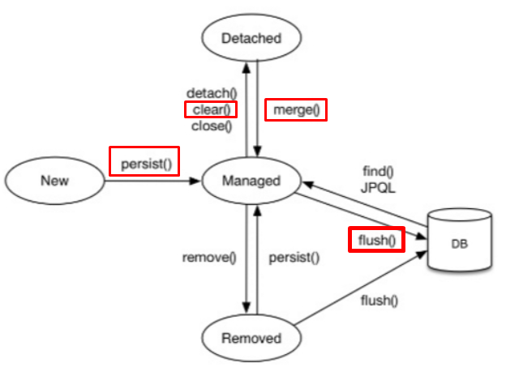

## 230619 Hibernate 

스프링부트에서 Hibernate는 ORM(Object-Relational Mapping) 기술을 사용하여 데이터베이스와의 상호 작
용을 쉽게 할 수 있도록 지원합니다.

Hibernate를 사용하면 자바 객체와 데이터베이스 테이블 간의 매핑을 쉽게 설정할 수 있으며, 객체를 데이터
베이스에 저장, 검색, 수정 및 삭제할 수 있습니다. Hibernate는 이러한 기능을 제공하기 위해 JPA(Java
Persistence API)를 구현하며, JPA는 Java에서 ORM을 구현하기 위한 API 표준입니다.

스프링부트에서 Hibernate를 사용하려면, `spring-boot-starter-data-jpa` 의존성을 추가하고,
`application.properties` 파일에 데이터베이스 연결 정보를 설정합니다. 또한, Entity 클래스를 작성하여
데이터베이스와 매핑을 설정합니다. Entity 클래스는 데이터베이스 테이블과 매핑됩니다.

Hibernate를 사용하면 데이터베이스 연결, 트랜잭션 관리 등의 기능을 쉽게 구현할 수 있습니다. 또한,
Hibernate는 캐싱, 지연로딩 등의 기능을 제공하여 성능을 향상시킬 수 있습니다.

## ORM

OM은 객체지향 프로그래밍 언어에서 데이터베이스에 저장된 데이터를 객체로 변환하는 기술을 말합니다. 이
때, 객체와 데이터베이스 사이의 매핑을 수동으로 정의하고 구현합니다.

ORM은 객체지향 프로그래밍 언어와 관계형 데이터베이스 사이의 데이터를 변환하는 기술로, ORM 프레임워
크가 자동으로 객체와 테이블 간의 매핑을 수행합니다. ORM은 JPA(Java Persistence API)와 같은 표준 API를
사용하여 데이터베이스와 연동할 수 있습니다.

즉, OM은 ORM의 일종으로 볼 수 있습니다. OM은 ORM보다 덜 복잡하지만, 매핑 작업을 직접 수행해야 하므
로 시간과 노력이 더 필요합니다. ORM은 매핑 작업을 자동화하여 생산성을 높이고, 객체지향적인 코드 작성
을 촉진합니다.

### 시퀀스 전략

데이터베이스 시퀀스를 이용하여 PK 값을 생성합니다. 이 전략을 사용할
때는 @SequenceGenerator 어노테이션을 이용하여 시퀀스를 생성해야 합니다.

GenerationType.IDENTITY는 데이터베이스의 Identity 컬럼을 이용하여 PK 값을 생성하는 자동 생성 전략입니
다. 이 때, 데이터베이스의 Identity 컬럼이란 데이터베이스에서 자동으로 값을 생성해주는 기능을 가진 컬럼
을 의미합니다. 이 기능을 지원하는 데이터베이스에는 MySQL, SQL Server, PostgreSQL 등이 있습니다.

### 테이블 전략

데이터베이스에 별도의 테이블을 생성하여 PK 값을 관리합니다. 이 전략을 사
용할 때는 @TableGenerator 어노테이션을 이용하여 테이블을 생성해야 합니다.

Identity 컬럼이 지원되지 않는 데이터베이스에서는 GenerationType.IDENTITY 전략을 사용할 수 없습
니다. 이 경우에는 다른 자동 생성 전략을 사용해야 합니다.

테이블에 번호를 세팅하고 그 값을 가져와서 활용한다.

### Auto Incremental

데이터베이스에 따라 자동으로 GenerationType.IDENTITY,
GenerationType.SEQUENCE, GenerationType.TABLE 중 하나를 선택합니다.

### 영속화

Hibernate에서 영속화(Persistence)는 엔티티 객체를 데이터베이스와 연결하여 영구적으로 저장하는 과정을
의미합니다. 영속화를 하기 위해서는 엔티티 객체를 영속성 컨텍스트(Persistence Context)에 추가해야 합니
다. 영속성 컨텍스트는 엔티티 객체를 관리하는 Hibernate의 핵심 메커니즘 중 하나로, 영속화된 엔티티 객체
를 캐싱하고, 변경된 내용을 추적하여 데이터베이스에 반영합니다.

Hibernate에서는 다음과 같은 영속화 관련 메소드를 제공합니다.

1. persist(entity) 영속성 컨텍스트에 엔티티 객체를 추가하여 영속화합니다. 이 때, 엔티티 객체는 데이터
   베이스에 저장되지 않은 상태이며, 영속성 컨텍스트 내에만 존재합니다. persist() 메소드는 엔티티 객체
   를 반환하지 않으며, void 타입을 반환합니다.
2. merge(entity) 엔티티 객체를 영속성 컨텍스트에 추가하거나, 이미 존재하는 엔티티 객체를 가져와서 변
   경된 내용을 데이터베이스에 반영합니다. merge() 메소드는 변경된 엔티티 객체를 반환하며, 이를 통해
   엔티티 객체를 계속 사용할 수 있습니다.
3. flush() 영속성 컨텍스트에 있는 엔티티 객체의 변경 내용을 데이터베이스에 반영합니다. 이 때, 데이터
   베이스에 저장되지 않은 엔티티 객체는 데이터베이스에 저장되지 않습니다. flush() 메소드는 void 타입
   을 반환합니다.
4. clear() 영속성 컨텍스트에 있는 모든 엔티티 객체를 제거합니다. 이 때, 변경된 내용은 데이터베이스에
   반영되지 않습니다. clear() 메소드는 void 타입을 반환합니다.

